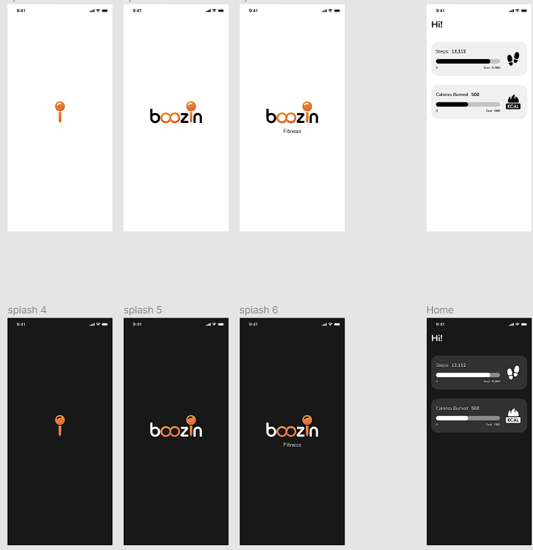

# Google Fit App

A Google fit   App to get the steps count and calories burned(in kilo calories)

## Features

- Display calories burned per steps
- LightWeight GetX Package
- Customizable to fit your use-case
- Open-source

## Prerequisites

- Flutter SDK

## Getting Started

1. Clone the repository
2. Run `flutter pub get` to install dependencies
3. Run the app on an emulator or physical device

The  customized to fit your use-case by modifying the code in the `main.dart` file and other files. The source code  available on GitHub.

### Development by

- Flutter - https://flutter.dev/
- GetX    - https://pub.dev/packages/get